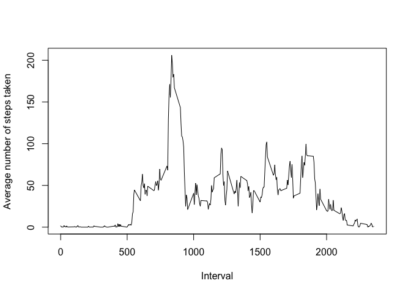
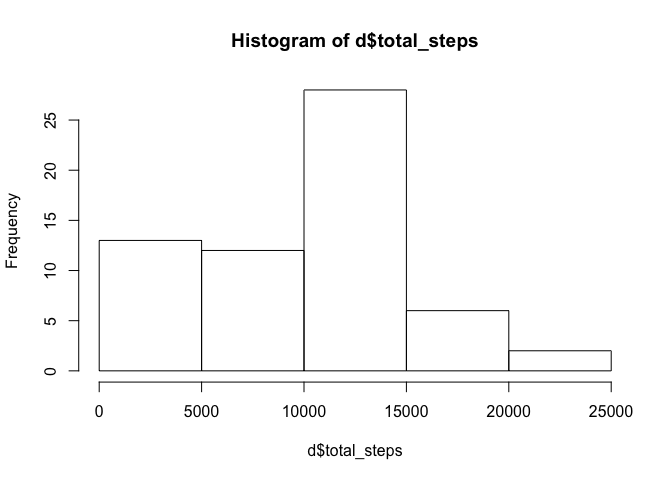

# Reproducible Research: Peer Assessment 1


## Loading and preprocessing the data

We load in the activity.csv file and can see from the stucture of the rawdata that there are 3 columns of data: $steps, $date, $interval.


```r
      activity <- read.csv("./activity.csv") 

      str(activity)
```

```
## 'data.frame':	17568 obs. of  3 variables:
##  $ steps   : int  NA NA NA NA NA NA NA NA NA NA ...
##  $ date    : Factor w/ 61 levels "2012-10-01","2012-10-02",..: 1 1 1 1 1 1 1 1 1 1 ...
##  $ interval: int  0 5 10 15 20 25 30 35 40 45 ...
```

```r
      summary(activity)
```

```
##      steps                date          interval     
##  Min.   :  0.00   2012-10-01:  288   Min.   :   0.0  
##  1st Qu.:  0.00   2012-10-02:  288   1st Qu.: 588.8  
##  Median :  0.00   2012-10-03:  288   Median :1177.5  
##  Mean   : 37.38   2012-10-04:  288   Mean   :1177.5  
##  3rd Qu.: 12.00   2012-10-05:  288   3rd Qu.:1766.2  
##  Max.   :806.00   2012-10-06:  288   Max.   :2355.0  
##  NA's   :2304     (Other)   :15840
```

In the function "perDayData" We use the dplyr library to group_by the dates and sum the total number of steps


```r
      perDayData <- function(data){
            
            library(dplyr)
      
            by_date <- group_by(activity, date)
      
            per_day <- summarise(by_date,
                  total_steps = sum(steps, na.rm = TRUE))
            
            return(per_day)
      }
```


## What is mean total number of steps taken per day?


We can draw a histogram to show the distribution of the totals for each date and calculate the mean and median total_steps.


```r
      DrawHistandPrintAverages <- function(d){
            
            hist(d$total_steps)
            
            steps_mean <- mean(d$total_steps)
            steps_median <- median(d$total_steps)
            
            print(steps_mean)
            print(steps_median)
            
      }
            
      DrawHistandPrintAverages(perDayData(activity))
```

```
## 
## Attaching package: 'dplyr'
## 
## The following object is masked from 'package:stats':
## 
##     filter
## 
## The following objects are masked from 'package:base':
## 
##     intersect, setdiff, setequal, union
```

 

```
## [1] 9354.23
## [1] 10395
```


## What is the average daily activity pattern?

This time we want to group_by the intervals and find the the means number of steps for each interval.


```r
      by_interval <- group_by(activity, interval)
            
            steps_per_interval <- summarise(by_interval,
                  mean_steps = mean(steps, na.rm = TRUE))
```

We then plot this on a line graph to show the distribution over the day.


```r
      plot(steps_per_interval$interval, steps_per_interval$mean_steps, 
           type="l", 
           xlab= "Interval",
           ylab= "Average number of steps taken")
```

 

To calculate the interval with the highest mean number of steps we use the max() function and match the interval to that number.


```r
      most_steps <- max(steps_per_interval$mean_steps)
      
      interval_with_most_ateps <- subset(steps_per_interval, mean_steps == most_steps)
  
      print(most_steps)
```

```
## [1] 206.1698
```

```r
      print(interval_with_most_ateps)
```

```
## Source: local data frame [1 x 2]
## 
##   interval mean_steps
## 1      835   206.1698
```


## Imputing missing values

As suggested we are going to replace the missing steps values with the mean step value for that interval. To do this we will write a function that returns the mean when passed the data set (activity) and an interval value (i):


```r
      returnIntervalMean<-function(activity, i){
            
            library(dplyr)
            
            by_interval <- group_by(activity, interval)
            
            steps_per_interval <- summarise(by_interval,
                  mean_steps = mean(steps, na.rm = TRUE))
            
            this_interval_mean <- subset(steps_per_interval, interval == i)
            
            return(this_interval_mean[2])
            
      }
```


We can see there are a number of NA values in the data:


```r
      print(sum(is.na(activity)))
```

```
## [1] 2304
```


We can now loop through the original data and create a new data set (activity_noNa) with all the NAs in the steps column replaced with the mean for that interval:


```r
      loopThroughData <- function(activity){
            
            activity_noNa <- activity

            for (n in 1:nrow(activity)){
                  
                  if(is.na(activity[n,1])){
                        
                        meanForThisInterval <- returnIntervalMean(activity,activity[n,3])
                        
                        activity_noNa[n,1] <- as.numeric(meanForThisInterval)
                  }                 
            }
            
            return(activity_noNa)
      }

      new_df<-loopThroughData(activity)

      summary(new_df)
```

```
##      steps                date          interval     
##  Min.   :  0.00   2012-10-01:  288   Min.   :   0.0  
##  1st Qu.:  0.00   2012-10-02:  288   1st Qu.: 588.8  
##  Median :  0.00   2012-10-03:  288   Median :1177.5  
##  Mean   : 37.38   2012-10-04:  288   Mean   :1177.5  
##  3rd Qu.: 27.00   2012-10-05:  288   3rd Qu.:1766.2  
##  Max.   :806.00   2012-10-06:  288   Max.   :2355.0  
##                   (Other)   :15840
```

Finally we can use the functions we wrote in the first part of the analysis to see if there are any differences:


```r
DrawHistandPrintAverages(perDayData(new_df))
```

 

```
## [1] 9354.23
## [1] 10395
```

Contrary to what I expected the addition of the missing values has no effect on the estimates of total daily steps. Perhaps the code is wrong (but it's getting late).

## Are there differences in activity patterns between weekdays and weekends?

We can check if a date is on the weekend using lubridate. We loop through the dataset and add a new column (logical) called "weekend":


```r
addWeekendCol <- function(d){
      
      weekend<- vector(length=0) #mode="boolean", 
      
      library(lubridate)
      
      for (n in 1:nrow(d)){
            
            thisDay <- as.POSIXlt(d[n,2])$wday -1
            
            if(thisDay<5){ # 0-4 = Mon-Fri. 5=Sat, 6=Sun
                  
                  weekend[n]=FALSE
                  
            }else{
                  
                  weekend[n]=TRUE    
            }      
      }
      
      new_d <- cbind(d, weekend) 
}

withWE <-addWeekendCol(activity)
```


We can see a summary of the new data:


```r
 print(summary(withWE))  
```

```
##      steps                date          interval       weekend       
##  Min.   :  0.00   2012-10-01:  288   Min.   :   0.0   Mode :logical  
##  1st Qu.:  0.00   2012-10-02:  288   1st Qu.: 588.8   FALSE:15264    
##  Median :  0.00   2012-10-03:  288   Median :1177.5   TRUE :2304     
##  Mean   : 37.38   2012-10-04:  288   Mean   :1177.5   NA's :0        
##  3rd Qu.: 12.00   2012-10-05:  288   3rd Qu.:1766.2                  
##  Max.   :806.00   2012-10-06:  288   Max.   :2355.0                  
##  NA's   :2304     (Other)   :15840
```

I ran out of time to do the line graph :(


