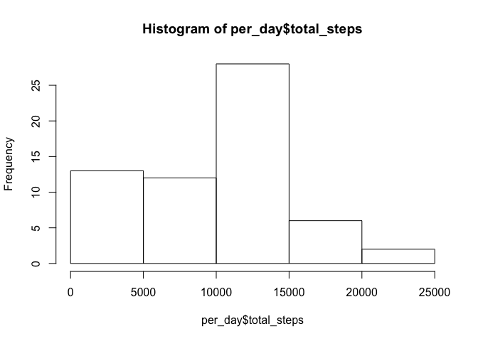

# Reproducible Research: Peer Assessment 1


## Loading and preprocessing the data

We load in the activity.csv file and can see from the stucture of the rawdata that there are 3 columns of data: $steps, $date, $interval.


```r
      activity <- read.csv("./activity.csv") 

      str(activity)
```

```
## 'data.frame':	17568 obs. of  3 variables:
##  $ steps   : int  NA NA NA NA NA NA NA NA NA NA ...
##  $ date    : Factor w/ 61 levels "2012-10-01","2012-10-02",..: 1 1 1 1 1 1 1 1 1 1 ...
##  $ interval: int  0 5 10 15 20 25 30 35 40 45 ...
```

We use the dplyr library to group_by the dates and sum the total number of steps


```r
      library(dplyr)
```

```
## 
## Attaching package: 'dplyr'
## 
## The following object is masked from 'package:stats':
## 
##     filter
## 
## The following objects are masked from 'package:base':
## 
##     intersect, setdiff, setequal, union
```

```r
      by_date <- group_by(activity, date)
      
      per_day <- summarise(by_date,
            total_steps = sum(steps, na.rm = TRUE))
```

We then draw a histogram to show the distribution of the totals for each date and calculate the mean and median total_steps.


```r
      hist(per_day$total_steps)
```

 

```r
      steps_mean <- mean(per_day$total_steps)
      steps_median <- median(per_day$total_steps)
      
      print(steps_mean)
```

```
## [1] 9354.23
```

```r
      print(steps_median)
```

```
## [1] 10395
```

## What is mean total number of steps taken per day?


## What is the average daily activity pattern?


## Imputing missing values


## Are there differences in activity patterns between weekdays and weekends?
